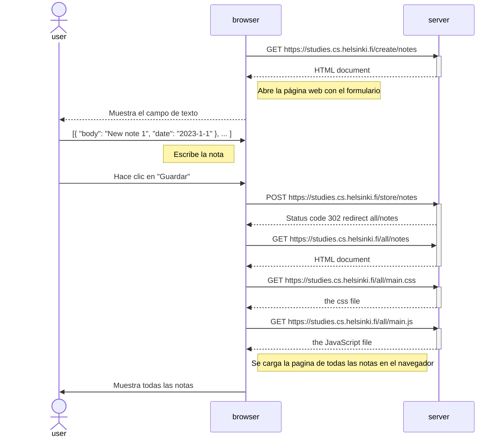

```mermaid

sequenceDiagram

    actor user
    participant browser
    participant server

    browser->>server: GET https://studies.cs.helsinki.fi/create/notes
    activate server
    server-->>browser: HTML document
    deactivate server

    Note right of browser: Abre la página web con el formulario

    browser-->>user: Muestra el campo de texto

    user->>browser: [{ "body": "New note 1", "date": "2023-1-1" }, ... ]

    Note left of browser: Escribe la nota

    user->>browser: Hace clic en "Guardar"


    browser->>server: POST https://studies.cs.helsinki.fi/store/notes
    activate server
    server-->>browser: Status code 302 redirect all/notes
    browser->>server: GET https://studies.cs.helsinki.fi/all/notes
    server-->>browser: HTML document
    deactivate server

    browser->>server: GET https://studies.cs.helsinki.fi/all/main.css
    activate server
    server-->>browser: the css file
    deactivate server

    browser->>server: GET https://studies.cs.helsinki.fi/all/main.js
    activate server
    server-->>browser: the JavaScript file
    deactivate server

    Note right of browser: Se carga la pagina de todas las notas en el navegador

    browser->>user: Muestra todas las notas
```