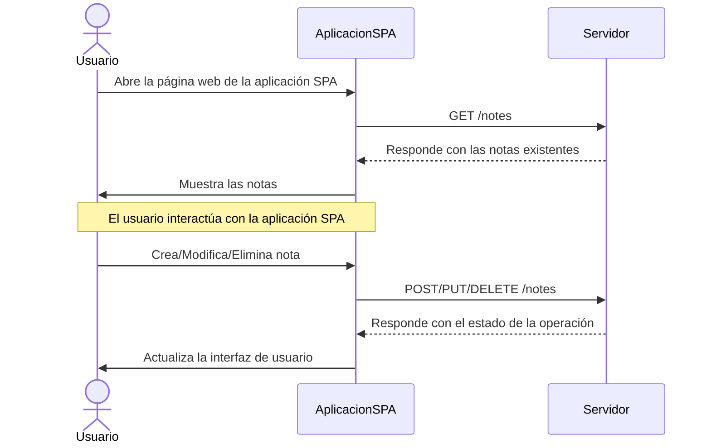

```mermaid
sequenceDiagram
    actor Usuario
    participant AplicacionSPA
    participant Servidor

    Usuario->>AplicacionSPA: Abre la página web de la aplicación SPA
    AplicacionSPA->>Servidor: GET /notes
    Servidor-->>AplicacionSPA: Responde con las notas existentes
    AplicacionSPA->>Usuario: Muestra las notas

    Note over Usuario,AplicacionSPA: El usuario interactúa con la aplicación SPA

    Usuario->>AplicacionSPA: Crea/Modifica/Elimina nota
    AplicacionSPA->>Servidor: POST/PUT/DELETE /notes
    Servidor-->>AplicacionSPA: Responde con el estado de la operación
    AplicacionSPA->>Usuario: Actualiza la interfaz de usuario
```